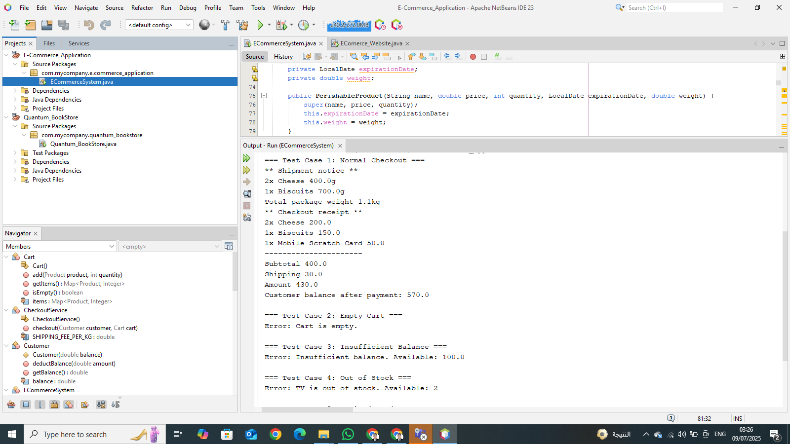

# E-Commerce_Application

<div align="center">
  
  
  [](https://www.java.com/)
  [](https://maven.apache.org/)
</div>

This is a Java-based e-commerce application designed to implement a fully functional shopping system. The application includes product management, a shopping cart, a checkout process with shipping and payment handling, and comprehensive exception handling. It was developed as part of the Fawry Rise Journey Full Stack Development Internship Challenge to demonstrate proficiency in Java programming, object-oriented design, and error management. The project is built using a single Java file (`ECommerceSystem.java`) and managed with Maven, making it easy to compile and run in NetBeans.

## Features

- **Product Management**: Supports two types of products:
  - **Perishable Products**: Items like Cheese and Biscuits with expiration dates and weights (e.g., 200g, 700g).
  - **Non-Perishable Products**: Items like Mobile Scratch Cards or TVs, with optional shipping capabilities and weights.
- **Shopping Cart**: Allows adding and managing items, with quantity validation to prevent over-ordering.
- **Checkout Process**: Handles payment deductions, calculates shipping fees based on weight (e.g., $30 for 1.1kg), and generates shipment notices and receipts.
- **Exception Handling**: Manages the following scenarios:
  - **Empty Cart Exception**: Prevents checkout with an empty cart.
  - **Insufficient Balance Exception**: Checks if the customer has enough funds.
  - **Out of Stock Exception**: Ensures sufficient product quantity is available.
  - **Expired Product Exception**: Validates perishable product expiration dates.
- **Test Cases**: Includes five test scenarios in the `main` method to demonstrate normal checkout, empty cart, insufficient balance, out-of-stock, and expired product cases.

## Technologies

- **Language**: Java (Utilizing JDK 23 for modern features like `java.time.LocalDate`).
- **Build Tool**: Maven (Manages dependencies and builds the project).
- **IDE**: NetBeans (Version 23 or later, used for development and debugging).
- **JDK**: 23 (Ensures compatibility with the latest Java features and libraries).

## Setup Instructions

To set up and run the **E-Commerce_Application** on your local machine, follow these steps:

1. **Clone the Repository**:
   - Open a terminal or command prompt.
   - Run the following command to clone the repository:
```
git clone https://github.com/MahmoudElhefnawyy/E-Commerce_Application.git
```
